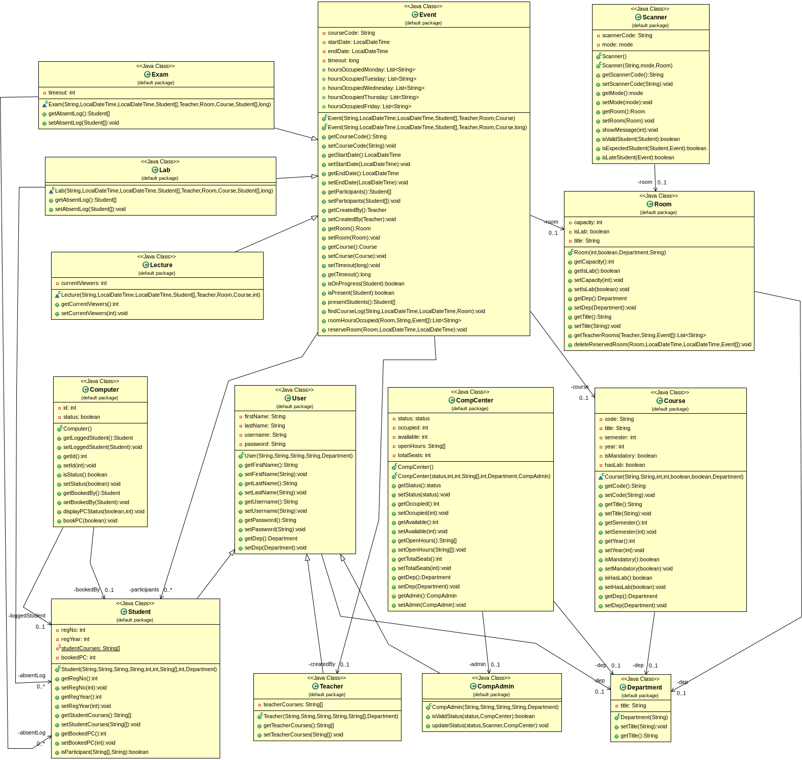

# UNI Access

## Περιγραφή

Σύστημα το οποίο επιτρέπει τη πρόσβαση και τη διαχείρηση των φοιτητών στους χώρους της σχολής ένος πανεπιστημίου.

Το project αυτό είναι μέρος του μαθήματος "Τεχνολογίας Λογισμικού" του τμήματος Μηχανικών Η/Υ & Πληροφορικής του Πανεπιστημίου Πατρών.

## Υλοποίηση

Οι υλοποιημένες κλάσεις του συστήματος μπορούν να βρεθούν στον φάκελο [src](src).

Το project έχει υλοποιηθεί σύμφωνα με το παρακάτω διάγραμμα.

## Εργαλεία
- Java
- Eclipse
